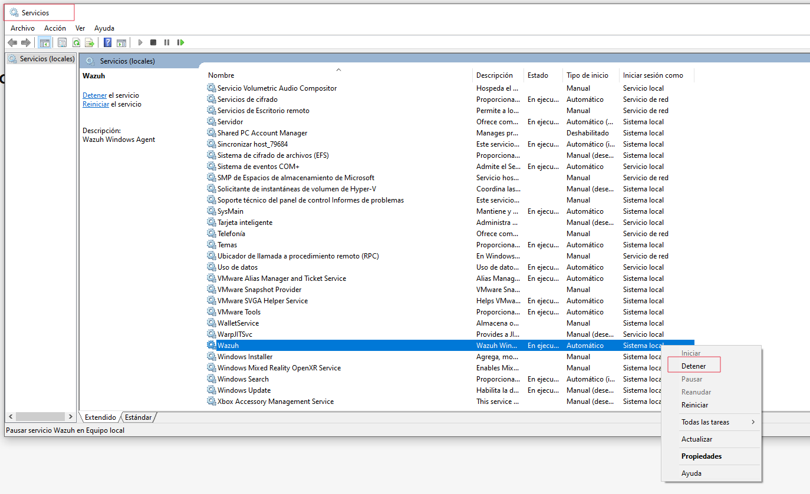
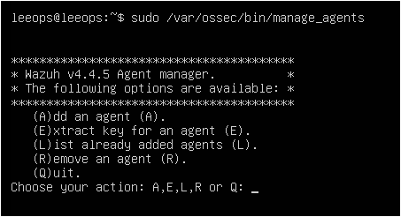
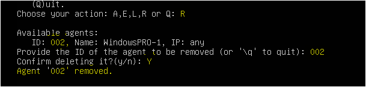
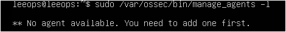

# **Eliminar un Agente desde el Manager (Linux)**
_(método oficial y el que funciona siempre)_

---
## 1. (Opcional pero recomendado) Parar el agente en la máquina cliente
---
Antes de borrarlo en el Manager, es buena práctica **detener el servicio del agente** en la máquina Windows Pro dónde lo hemos instalado
Así evitamos que vuelva a conectarse y genere un ID nuevo.

**Windows:**  
`services.msc → Wazuh Agent → Detener`



---
## 2. Ver todos los agentes registrados en linux
---
En el servidor Wazuh ejecutamos:

````
sudo /var/ossec/bin/manage_agents -l
````

Aparecerá una lista con:

- ID del agente
- nombre del agente
- IP
- estado

Elige el **ID del agente que quieres eliminar**.


---
## 3. Entrar al gestor de agentes
----
Ejecuta:
```
sudo /var/ossec/bin/manage_agents
```

Se abrirá un menú.
Selecciona la opción: `R) Remove agent`



El sistema te pedirá:

- **ID del agente a borrar**
- Confirmación (**y/n**)




---
## 4. Confirmar eliminación
---
Si vuelves a ejecutar:

```
sudo /var/ossec/bin/manage_agents -l
```

Verás que el agente ya no aparece.



---
## 5. Comprobarlo en el Dashboard
---
Abre el Dashboard → **Management → Agents** y actualiza la vista.  
El agente eliminado ya no debería aparecer.

---

