# 🟦 **Instalación y Registro de los Agentes de Wazuh**

En este punto del laboratorio, el servidor Wazuh ya está funcionando correctamente.  
Ahora toca el siguiente paso clave: **conectar nuestras máquinas al SIEM mediante los agentes**.

Este apartado explica, de forma sencilla y guiada, cómo instalar el agente, registrarlo en el Manager y aplicar la configuración personalizada del laboratorio.

---
## 1-¿Qué es un agente?
---
Un **agente** es un **programa pequeño** que instalas en cada máquina que quieres **monitorizar**:

- en un **Windows**
- en un **Ubuntu**
- en un **servidor**
- en un **PC**
- en una **máquina del laboratorio**
- incluso en contenedores

#### Ese agente hace 3 cosas:

##### - 1. Recolecta información del sistema

Cosas como:
  - logs del sistema
  - procesos
  - cambios en archivos
  - puertos abiertos
  - conexiones de red
  - integridad de ficheros
  - vulnerabilidades del software instalado


##### - 2. Envía los datos al Wazuh Manager 
Es el **Wazuh Manager** el que analiza, corre reglas, detecta alertas y correlaciona eventos

##### - 3. Obedece al Manager

El Manager puede mandarle:
  - configuraciones
  - reglas nuevas
  - órdenes para monitorear carpetas
  - políticas de integridad
  - módulos de inventario, etc.

El agente recibe → aplica → devuelve resultados.

#### En resumen:

**Agente = programa instalado en cada máquina que quieres vigilar.**  
Se comunica con el Manager, le envía lo que pasa dentro del host, y permite que Wazuh haga su trabajo.

Sin agentes, Wazuh sería un “centro de mando” sin soldados en el terreno.

___
## 2- Preparación
---
Antes de comenzar con la instalación de agentes o la configuración avanzada del laboratorio, asegúrate de que **todas las máquinas del entorno están levantadas y operativas**.

### PASO 1: Arranca la máquina Ubuntu (Manager de Wazuh)
Esta VM es donde está instalado Wazuh All-in-One.
#### ✔️ Comprueba que los servicios están funcionando

Desde la terminal de Ubuntu ejecuta:

```
sudo systemctl status wazuh-manager
```

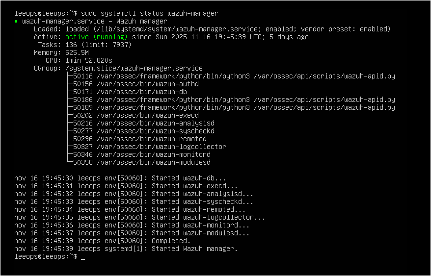

```
sudo systemctl status wazuh-indexer 
```

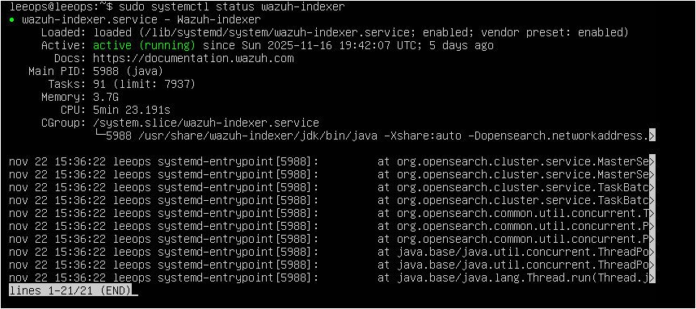

```
sudo systemctl status wazuh-dashboard
````

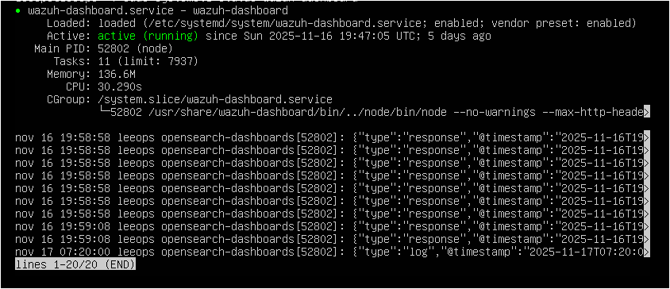

Los tres deben aparecer como **active (running)**, igual que en las imágenes.

> Si alguno aparece en rojo o “failed”, reinícialo:

```
sudo systemctl restart wazuh-manager 
sudo systemctl restart wazuh-indexer 
sudo systemctl restart wazuh-dashboard
````

---
### PASO 2: Arranca la máquina Windows (agente + dashboard)
Windows actuará como **endpoint monitorizado** y también como equipo desde el que accederemos al Dashboard.

#### ✔️ Comprueba la conectividad entre Windows y Ubuntu

En Windows: `ping <IP-de-Ubuntu>`
En Ubuntu: `ping <IP-de-Windows>`

Debe haber comunicación en ambas direcciones.

#### ✔️ Accede al Dashboard de Wazuh

Desde Windows, abre tu navegador y entra en: `http://<IP-del-Manager>:5601`

Ejemplos habituales:

- Si Wazuh está en localhost:  
    `http://127.0.0.1:5601`
    
- Si Wazuh está en otra VM:  
    `http://192.168.X.X:5601`
    
Es normal que el navegador muestre una advertencia de conexión no privada.  
Pulsa **“Avanzado” → “Continuar”** para entrar.

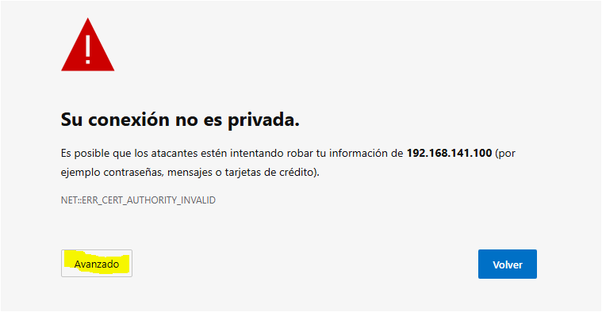

Inicia sesión con el usuario y contraseña que configuraste al instalar Wazuh.

**Nota:**  
Si no carga el Dashboard:

- comprueba que la máquina Ubuntu está encendida,
- que los servicios del Manager están en _running_,
- y que el puerto **5601** está accesible desde Windows.  
    
Revisa también las reglas del firewall de Windows si fuera necesario.

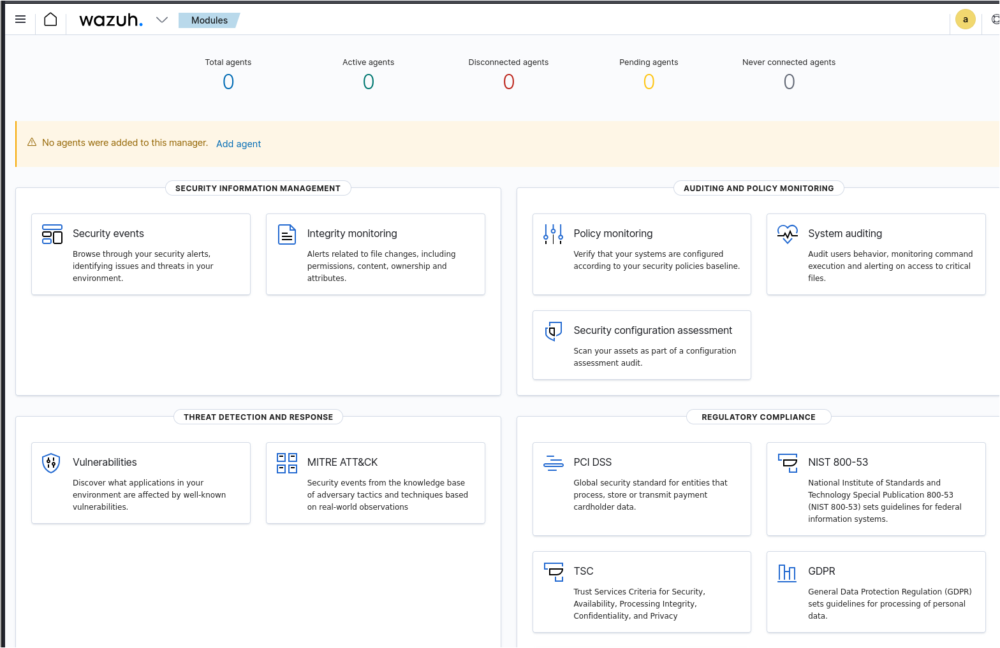

---
## 3. Descarga e instalación del Primer Agente
---
Para conectar Windows a nuestro entorno Wazuh, utilizaremos el instalador oficial del agente y el comando que genera automáticamente el Dashboard.

### Accede al instalador desde el Dashboard
En el Dashboard de Wazuh, entra en:
👉 **Modules → Agents**

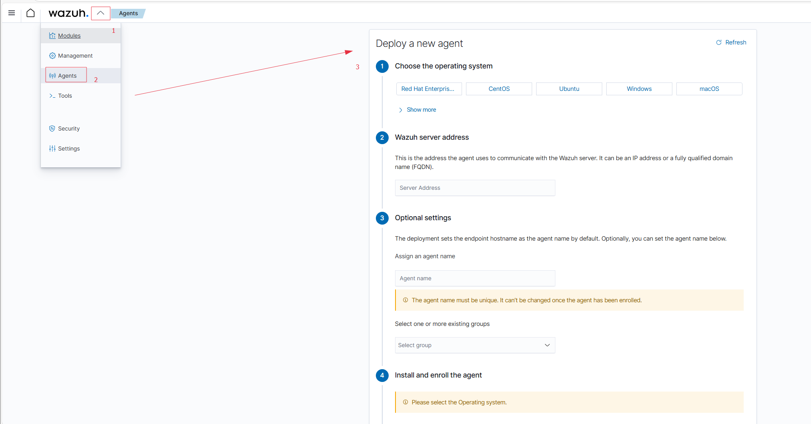

##### ✔️ **1. Seleccionar el sistema operativo**
En **“Choose the operating system”**, elige:
🔵 **Windows** (Verás cómo el botón se marca en azul.)

##### ✔️ **2. Indicar la IP del Wazuh Manager**
En **“Wazuh server address”**, introduce la **IP del Ubuntu donde instalaste Wazuh**.
Ejemplo: `192.168.94.10`

⚠️ No uses `localhost` ni `127.0.0.1`.

##### ✔️ **3. Asignar nombre al agente (opcional)**
En **“Assign an agent name”** puedes:

- **Dejarlo vacío** → usará el nombre del equipo Windows
- O poner un nombre único → `win10-lab`, `windows-endpoint-1`, etc.

El grupo puede quedarse en **default**, suficiente para este laboratorio.

##### ✔️ **4. Instalar y registrar el agente automáticamente**
Desplázate abajo hasta:

👉 **Install and enroll the agent**
Wazuh generará un comando PowerShell similar a este:

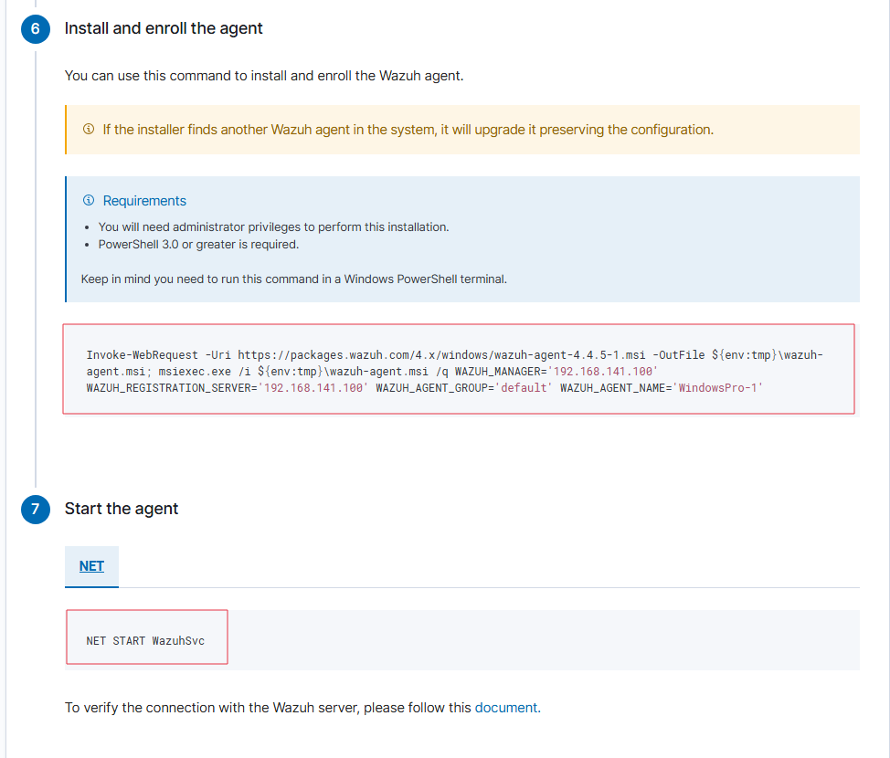

Cópialo y ejecútalo en **PowerShell como Administrador**.

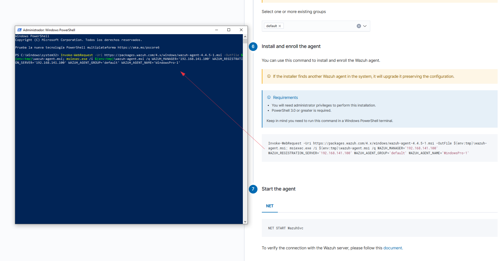

Tras ejecutar el comando, aparecerá la confirmación de instalación:

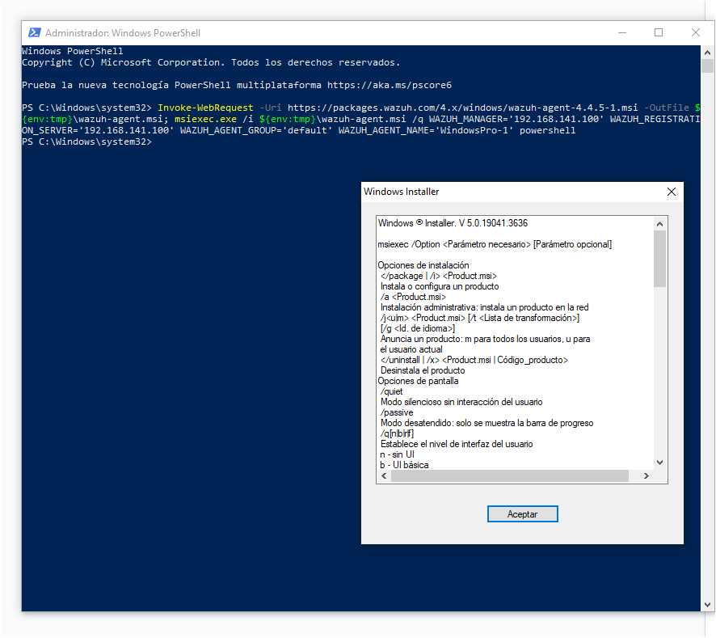

##### ✔️ **5. Arranca el servicio del agente**
En PowerShell ejecuta: `NET START WazuhSvc`


### **¿Qué hace este comando realmente?**
- **Descarga** el instalador oficial del agente Windows desde los repositorios de Wazuh.
- **Instala** el agente en modo silencioso (sin asistente gráfico).
- **Configura** automáticamente la IP del Manager y el servidor de registro.
- **Registra** el agente en tu servidor Wazuh sin pedir claves ni pasos manuales.
- **Asigna** el nombre del agente y el grupo seleccionado en el Dashboard.
- **Deja el servicio listo para arrancar** (`WazuhSvc`).

---
## 4. Verificar que el agente aparece en el Dashboard
---

Vuelve a:

👉 **Modules → Agents**

Y deberías ver tu agente en estado:

- **pending**
- **enrolling**
- o **active**

Como en el ejemplo:
El siguiente paso es verigicar que el agente aparece en nuestro dashboard, y como podemos observar así es.

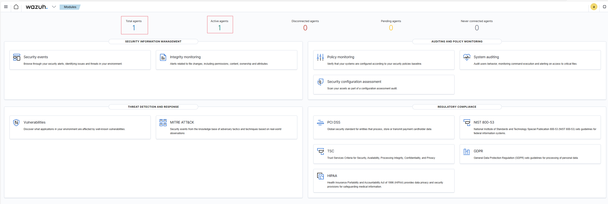

---
## 5- Alta de nuevos agentes cuando ya existe uno registrado
---

Una vez tienes **al menos un agente** dado de alta, la pantalla completa de “Add agent” **ya no aparece automáticamente**.  
Para añadir más agentes, debes abrir manualmente el asistente desde el panel de agentes.

En el Dashboard, ve a:
**Modules → Agents → botón “Add agent”**

Lo tienes señalado en rojo en la siguiente imagen:

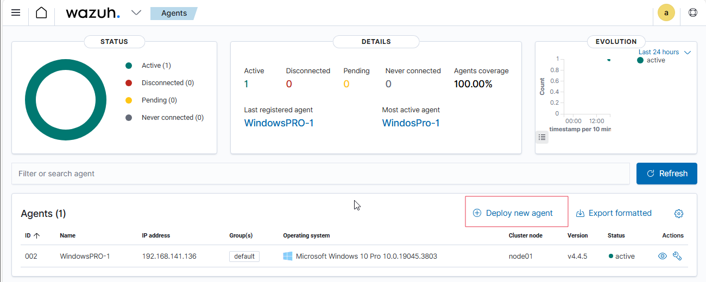

Aparecerá la ventana de creación de agentes que hemos visto antes.

---
