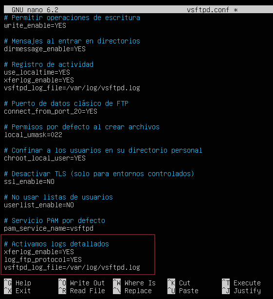

# Reglas FTP para Wazuh

---
## ¿Dónde están las reglas?
---

Ruta:  
`rules/ftp/ftp-events.xml`

Dentro tienes:

✔️ Login fallido  
✔️ Fuerza bruta (fallos repetidos)  
✔️ Login correcto  
✔️ Login correcto tras bruteforce  
✔️ Subida de archivos  
✔️ Subida de ejecutables o scripts  
✔️ Descargas  
✔️ Eliminaciones sospechosas

---
## 1. Copiar el archivo de reglas a Wazuh
---
Solo si no lo has hecho antes
```
git clone https://github.com/LeeOps/secops-training
cd secops-training

# Copia el archivo de reglas al Wazuh Manager
sudo cp configuracion/rules/ftp/ftp-events.xml /var/ossec/etc/rules
```

Esto deja las reglas ya cargadas en el Manager.

---
## 2. Activar los logs en vsftpd
---

Sí, esta configuración debe añadirse ahora en el mismo archivo que configuramos anteriormente, en la sección de Servicios.

¿Y por qué no estaba incluida antes?

> Porque esta parte _no forma parte de la configuración vulnerable del servicio_, sino de la **integración con Wazuh** para que el SIEM pueda leer los logs.  
> 
> La configuración vulnerable la dejamos “realista”, y la parte de logging solo se activa cuando necesitamos que Wazuh analice la actividad del FTP.

En `/etc/vsftpd.conf` añade o deja así: 

```
xferlog_enable=YES log_ftp_protocol=YES vsftpd_log_file=/var/log/vsftpd.log
```



---
## 3. Reiniciar vsftpd
---

Para que empiece a generar los logs que Wazuh necesita

```
sudo systemctl restart vsftpd
sudo systemctl status vsftpd
```


---
## 4. Reiniciar Wazuh Manager
----

Para que cargue las reglas nuevas.

```

sudo systemctl restart wazuh-manager
```

---
