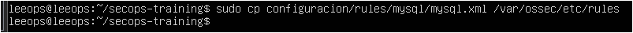

# Reglas MYSQL para Wazuh 
Porque MySQL vulnerable es maravilloso para aprender…  
pero si no añades reglas personalizadas, Wazuh verá el robo de tu base de datos **como quien ve pasar una nube**: lo mira, lo ignora… y sigue rascándose el índice.

Este módulo existe para que tu SIEM no solo presuma de dashboard bonito, sino que **detecte cosas que importan de verdad**.

---
##  ¿Qué hace este módulo?
---

Añade un archivo de reglas que permite a Wazuh decir cosas como:

- “Eh, aquí están intentando entrar como _admin_ desde medio internet.”
- “¿mysqldump ejecutado? Igual están levantándose tus datos…”
- “Te han descargado el backup expuesto, por si tenías dudas.”
- “Están trasteando phpMyAdmin. Y no para ver el logo.”
- “Alguien activó el general_log… o sea, filtración garantizada.”

Vamos, lo que un SIEM decente debería gritar **antes** de que desaparezca la base de datos.

---
## ¿Dónde están las reglas?
---

Aquí:  
`rules/mysql/mysql.xml`

Dentro tienes:

- detección de usuario débil
- acceso remoto
- mysqldump sospechoso
- acceso al backup expuesto
- activación del general_log
- detección de phpMyAdmin
- intentos de login
- reglas combinadas de criticidad

Vamos, un pack completo para que Wazuh parezca inteligente.

---
## 1. Copia el archivo de reglas 
---

```
# Si no has clonado aún:
git clone https://github.com/LeeOps/secops-training 
cd secops-training  

# Copiar reglas al Wazuh Manager:
sudo cp configuracion/rules/mysql/mysql.xml /var/ossec/etc/rules
```

Si lo pones en otro sitio, Wazuh hará lo que mejor sabe:  
**ignorar tus ilusiones**.



Y ya estaría
A partir de aquí, cada intento fallido, ataque torpe o acceso de root  quedará registrado.

---
