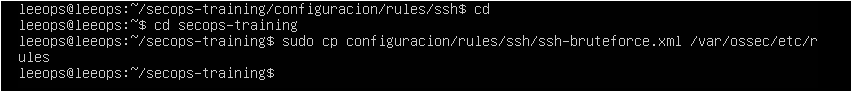

# Reglas SSH para Wazuh 
Porque sí, Wazuh es muy listo…  
pero si no le pones reglas personalizadas, un ataque de fuerza bruta SSH le pasa por delante **como si fuera un repartidor de Amazon**: lo ve, lo saluda, y sigue a lo suyo.

Este módulo existe para que tu SIEM haga algo más que decorar el dashboard.

---
##  ¿Qué hace este módulo?
---

Añade un archivo de reglas que permite a Wazuh decir:

- “Eh, aquí están fallando contraseñas como si regalaran cuentas de Netflix”
- “Oye, esta IP está pegando martillazos en SSH”
- “Vale… después de 50 intentos, han entrado. Igual deberíamos preocuparnos”

Vamos, lo mínimo que se espera de un SIEM que cobra por CPU.

---
## Dónde están las reglas
---

Aquí:
`rules/ssh/ssh-bruteforce.xml`

Dentro está todo: detección de fallos, frecuencia, IP, logins sospechosos y demás alegrías.

---
## Requisitos (no te asustes)
---

- Tener un **Wazuh Manager** funcionando
- Que tu Linux esté enviando los logs del SSH (auth.log)
- Tener manos para escribir `sudo`
- Ganas de ver el dashboard explotar en alertas

No necesitas nada más que copiar un archivo.

---
## 1. Copia el archivo de reglas 
---

```
# Solo si no lo has hecho antes
git clone https://github.com/LeeOps/secops-training
cd secops-training

# Copia el archivo de reglas al Wazuh Manager
sudo cp configuracion/rules/ssh/ssh-bruteforce.xml /var/ossec/etc/rules
```

Si lo pones en otro sitio, Wazuh llorará. 



---
## Y ya estaría
A partir de aquí, cada intento fallido, ataque torpe o acceso de root  quedará registrado.

---
