# ✅ Instalación de Ubuntu Server 22.04 LTS 

---
## 0. Preparación del entorno
---

### Descarga de Ubuntu Server 22.04 LTS

Sistema operativo obtenido desde la página oficial de Canonical:

**URL oficial:**  
[https://ubuntu.com/download/server/thank-you?version=22.04.5&architecture=amd64&lts=true](https://ubuntu.com/download/server/thank-you?version=22.04.5&architecture=amd64&lts=true)

**ISO descargada:**  
`ubuntu-22.04.5-live-server-amd64.iso`

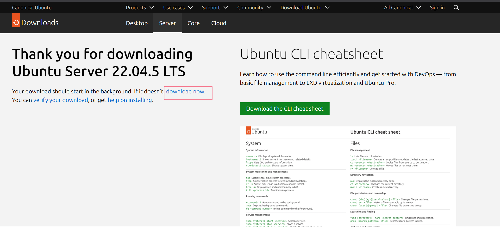

---
### Verificación de integridad (SHA256)

En Linux/macOS:

```
sha256sum ubuntu-22.04.5-live-server-amd64.iso
```

En Windows (PowerShell):

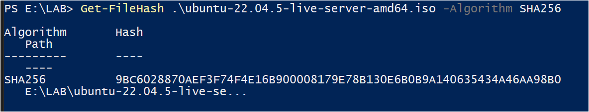

Comparar con el valor oficial de Canonical:  
[https://releases.ubuntu.com/22.04.5/SHA256SUMS](https://releases.ubuntu.com/22.04.5/SHA256SUMS)

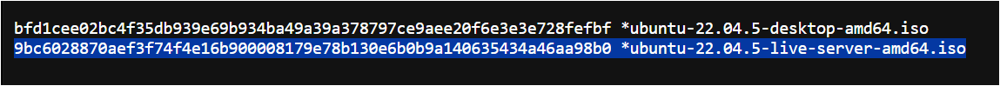
Si coinciden, la ISO es íntegra y segura para su uso en el laboratorio.


---
## 1. Instalación del Servidor Ubuntu
---
### 1. Requisitos mínimos del laboratorio (Ubuntu 22.04 + Wazuh)

#### Requisitos mínimos
- **2 vCPU**
- **4 GB RAM**
- **40 GB de disco**
- **Red NAT**
- Conexión a internet
- Ubuntu Server 22.04 LTS

#### Requisitos recomendados
- **2–4 vCPU**
- **6–8 GB RAM**
- **50–80 GB de disco**
- Red NAT
- OpenSSH instalado durante la instalación

Estos valores garantizan estabilidad al ejecutar Wazuh Manager + Indexer + Dashboard.

---
### 2. Creación de la máquina virtual en VMware
####  🔹 Paso 1 — Crear nueva máquina virtual
1. Abrir **VMware Workstation / Player**.  
2. Seleccionar la opción **Create a New Virtual Machine**.  
3. Elegir el tipo de configuración: **Typical (recommended)**.

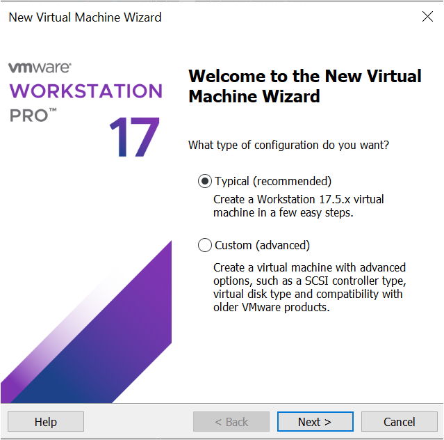

####  🔹 Paso 2 — Seleccionar la ISO de instalación
1. En **Installer disc image (ISO)**, pulsar *Browse*.  
2. Seleccionar el archivo:  
   `ubuntu-22.04.5-live-server-amd64.iso`  
3. VMware detectará automáticamente “Ubuntu 64-bit”.

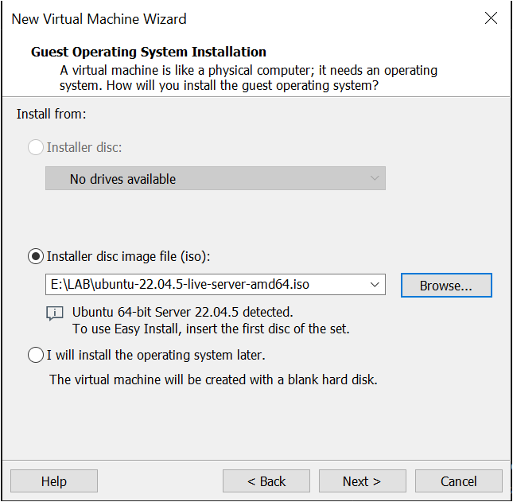

####  🔹 Paso 3 — Asignar nombre y ubicación de la VM
VMware pedirá un nombre para la máquina y la carpeta donde se guardarán sus archivos.

- **Name:** `Ubuntu-Server-wazu`  
  > Usa un nombre claro y corto. Evita espacios.

- **Location:** Seleccionar una carpeta del equipo donde quieras guardar este laboratorio  
  (por ejemplo: `Documentos/VMs/wazu/`).

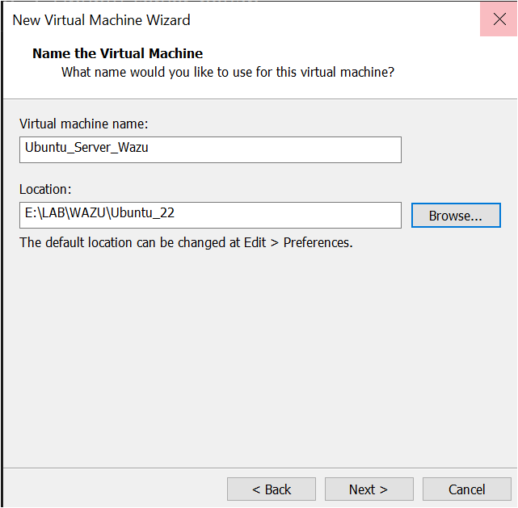

####  🔹 Paso 4 — Configurar disco virtual
VMware pedirá crear el disco duro donde se instalará Ubuntu Server.

Aparecen dos opciones importantes:
##### 4.1 Maximum disk size (GB)
Es el tamaño máximo que podrá ocupar el disco dentro de la máquina virtual.
- **60 GB** (recomendado para Wazuh)  
Si quieres ir sobrad0: **80 GB**

##### 4.2. Store virtual disk as a single file 
Esta opción decide **cómo se guarda el disco en tu PC**:

- **Single file →** crea un único archivo grande.  
  ✔ Mejor rendimiento  
  ✔ Menos fragmentación  
  ✔ Ideal para máquinas que vas a usar bastante  
  ✔ Más limpio para mover/copiar

- **Split into multiple files →** divide el disco en muchos archivos pequeños.  
  ✔ Útil solo si usas discos externos antiguos o FAT32 (que casi nadie usa hoy)  
  ❌ Peor rendimiento  
  ❌ Más archivos = más lío

> Recomendación: **Store virtual disk as a single file** (una sola pieza, limpio y sin problemas).

##### Resultado final recomendado
- **Disk size:** 80 GB  
- **Disk type:** Single file (recomendado)

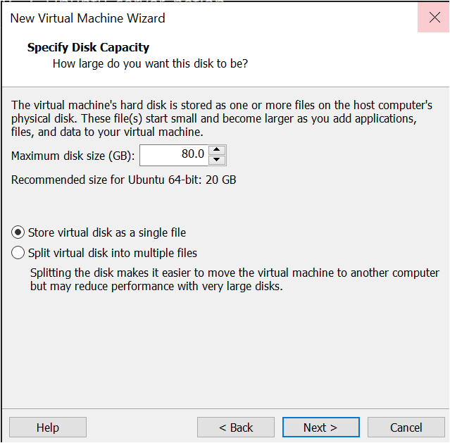

#### 🔹 Paso 5 — Ajustar CPU, RAM y red

En **Customize Hardware:
- Network Adapter → NAT
- Memory → 6- 8 
- Display: Acelerate Grafics : → Desmarcar

Esta opción activa la aceleración gráfica por hardware dentro de la máquina virtual.  
Es útil para sistemas con **interfaz gráfica**, animaciones o aplicaciones 3D.  
Pero en **Ubuntu Server** (sin entorno gráfico) no aporta ningún beneficio.

**Por qué se desactiva:**
- Ubuntu Server **no usa GPU ni entorno gráfico**, así que no aprovecha esta función.
- Mantenerla activada consume RAM y CPU innecesariamente.
- Puede causar ralentizaciones o inestabilidad en servidores virtuales.
- Evita conflictos al instalar servicios como **Wazuh**, que no requieren ni utilizan aceleración gráfica.

**En resumen:**  
👉 _Desactívalo siempre en servidores: reduce consumo y mejora la estabilidad._

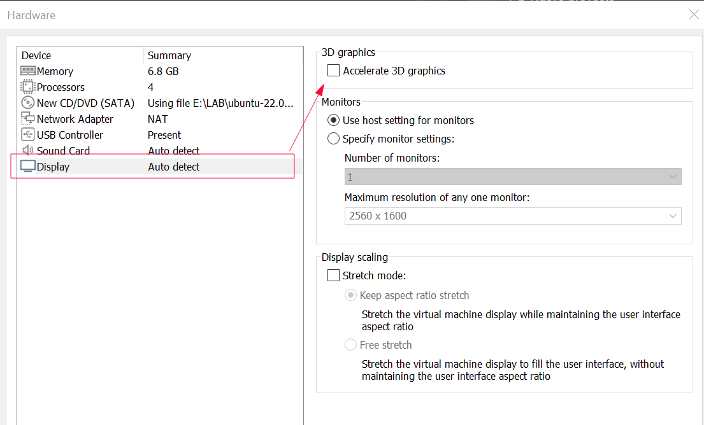

- Processors: 
   Para que la VM funcione con buen rendimiento, es obligatorio activar la virtualización por hardware del procesador.  
Esto permite que VMware utilice directamente las extensiones de virtualización de la CPU en lugar de emularlas por software.

**Según tu procesador:**
- **Intel:** activar **VT-x / EPT**
- **AMD:** activar **AMD-V / RVI**
- **Apple Silicon (M1/M2/M3):** ya viene habilitado automáticamente por el hipervisor (no configurable)

**Beneficios al activarlo:**
- Rendimiento mucho mayor
- Menos carga de CPU real
- Wazuh Indexer y Manager más estables
- Procesos más rápidos y sin bloqueos
    
**En resumen:**  
👉 _Activa siempre las extensiones de virtualización del procesador si tu sistema las soporta._

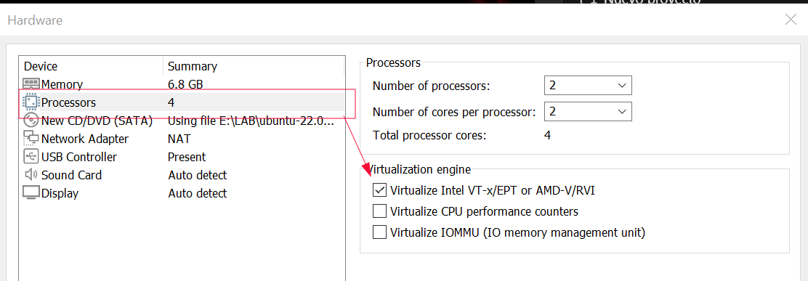

####  🔹 Paso 6 — Finalizar creación
Pulsar **Finish** para crear la máquina.
La VM está lista para iniciar la instalación del sistema operativo.

---
### 2. Instalación de la ISO
Al iniciar la máquina por primera vez, aparece el menú de arranque de Ubuntu Server (GRUB).

Seleccionar la opción:
**→ Try or Install Ubuntu Server**

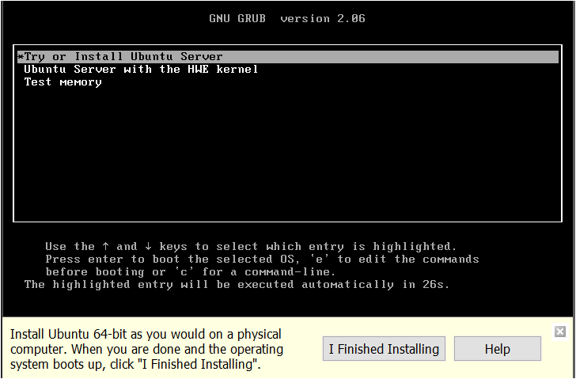

####  🔹 Paso 1 — Idioma
Seleccionar **Español** y confirmar con **Hecho**.
El idioma elegido no afecta a la configuración técnica del laboratorio._

####  🔹 Paso 2 — Tipo de Instalación

Mantener la opción predeterminada:  **Ubuntu Server**  
(No seleccionar _Ubuntu Server (minimized)_).
####  🔹 Paso 3 — Opciones Adicionales (Additional options):**  
Dejar todas las casillas **sin marcar**.

####  🔹 Paso 4 — Actualización del Instalador
Si aparece un mensaje ofreciendo actualizar al “nuevo instalador”, seleccionar **NO actualizar**.
En ocasiones redirige al instalador de Ubuntu 24.04, que no es compatible con este laboratorio.

####  🔹 Paso 5 — Configuración Inicial
Continuar avanzando con **Enter** manteniendo las opciones por defecto hasta llegar a la pantalla de creación de usuario y configuración inicial del sistema.

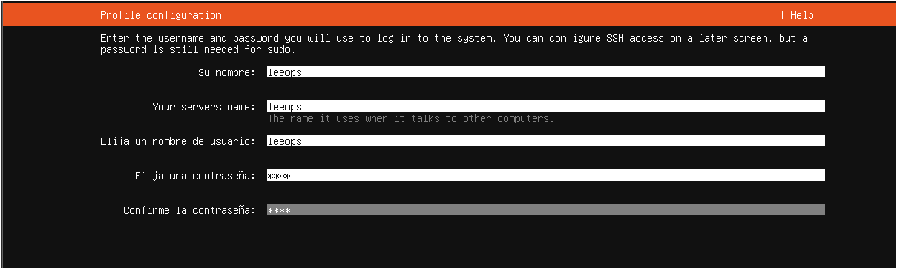

####  🔹 Paso 6 — Instalar servidor SSH**
Avanza por las pantallas manteniendo las opciones por defecto hasta llegar a la sección **“Instalar servidor OpenSSH”**.  

En este punto, **habilita la opción** y continúa con la instalación.

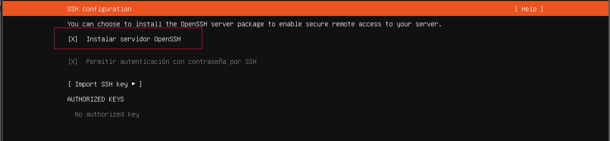

Tras habilitar el servidor OpenSSH, continúa avanzando por las pantallas manteniendo las opciones por defecto. 

####  🔹 Paso 7 — Finalizar  Instalación
El instalador seguirá con el proceso y comenzará automáticamente la instalación del sistema.
Cuando termine reiniciamos sistema.

---
## 2. Comprobaciones Iniciales
---
### 1. Comprobar usuario y contraseña 
Acceder con nuestras credenciales para verificar que funcionan

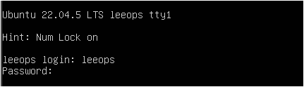

###  2. Comprobar IP
Debes ver algo así: `ens33` o `ens160`  con una IP tipo **192.168.x.x** o **10.0.x.x**
     
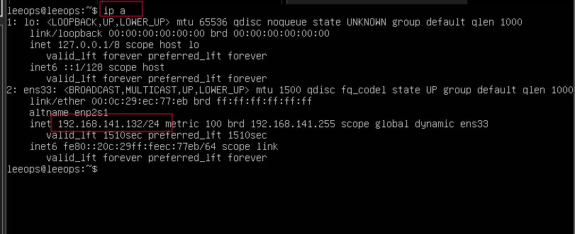

### 3. Comprobar conexión a Internet

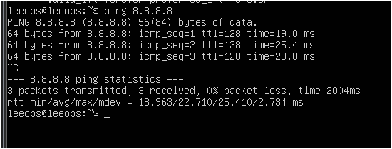

### 4. Comprobar resolucción DNS

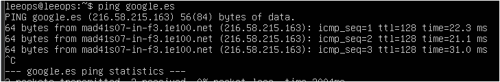

### 5. Comprobar Servidor SSH Activo
Debe decir: `active (running)`
Si está “inactive”, lo levantamos: `sudo systemctl start ssh`

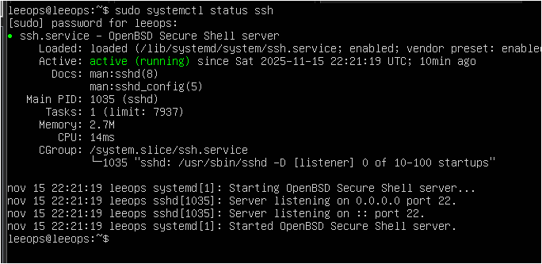

Con esto dejamos completada la instalación y validación básica de **Ubuntu Server 22.04**.  
El sistema está operativo, con red funcional y acceso SSH preparado para continuar.


---
## ➡️ Siguiente Paso: Instalación de Wazuh
---

La siguiente fase del laboratorio será:
- Actualizar el sistema
- Descargar e instalar **Wazuh (All-in-One)**
- Acceder al dashboard
- Iniciar la configuración del SIEM

 ## 👉 [Ir a Instalación Wazu](../wazu/README.md)

