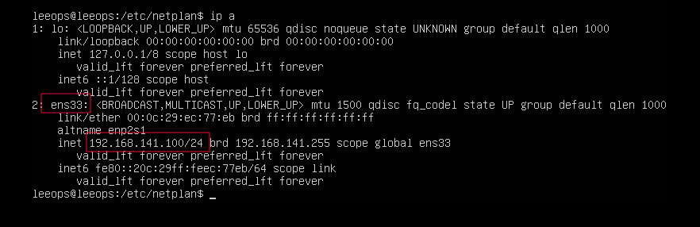
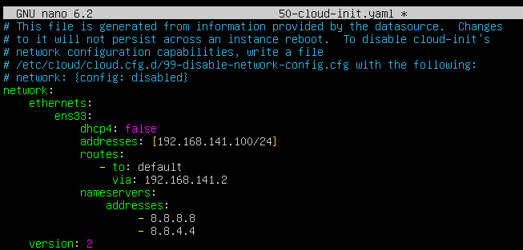
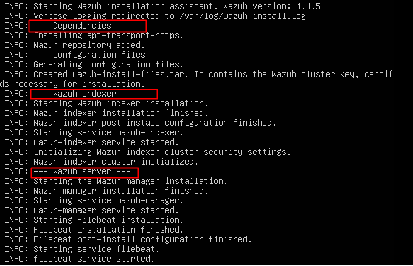
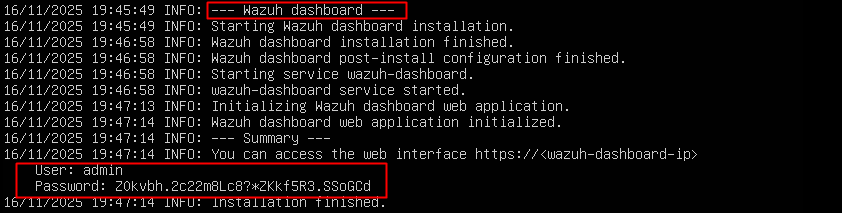

# ✅ Instalación de Wazuh All-in-One (SIEM)

Este documento describe la instalación de **Wazuh All-in-One** sobre el servidor **Ubuntu 22.04** previamente desplegado en el laboratorio.

---
## 0. Requisitos previos
---

- Ubuntu Server 22.04 instalado y actualizado
- Acceso SSH al servidor
- Usuario con permisos `sudo`
- Conexión a Internet

---
## 1. Preparación del sistema
---
Antes de instalar Wazuh, dejamos el servidor listo
- paquetes actualizados
- red estable
- **IP fija**
- conectividad correcta (ping a Internet)
    
Esto evita errores después con el indexer, el dashboard y los certificados.

### 1.1 Configurar IP fija con Netplan

Para que Wazuh no colapse cada vez que el servidor cambie de IP, lo primero es **asignar una dirección fija**. En un laboratorio esto no es opcional: si el DHCP decide darte una IP distinta mañana, el indexer, el dashboard y medio SIEM se descuadran.

#### **1.1.1. Ver qué interfaz de red tenemos**

Antes de tocar Netplan, necesitamos saber **qué interfaz usa Ubuntu** y qué parámetros tiene ahora mismo. Lo comprobamos con:

`ip a`

Según el entorno, los nombres más comunes son:

- `ens33` → VMware (NAT o Bridge)
- `enp0s3` → VirtualBox
- `eth0` → servidores físicos o cloud
    

En mi caso, la interfaz es:
- **Interfaz:** `ens33`
- **IP asignada por DHCP:** `192.168.141.100`



#### 1.1.2. Editar el archivo Netplan
Una vez identificada la interfaz, dejamos de depender del DHCP y configuramos el servidor con **una IP fija estable**. Entramos al directorio de Netplan:

```
cd /etc/netplan 
```

Ubuntu crea distintos archivos dependiendo del tipo de instalación:

- **Ubuntu Server (instalación sin entorno gráfico):**  
    `50-cloud-init.yaml`
- **Ubuntu Desktop (instalación con GUI):**  
    `00-installer-config.yaml`

💡 **En esta guía estoy usando Ubuntu Server (CLI), así que el archivo correcto es `50-cloud-init.yaml`

En este archivo definiremos:
- la interfaz (`ens33`)
- la IP fija
- la máscara de red
- la puerta de enlace
- servidores DNS



#### 1.1.3. Aplicar configuración

Cuando hayamos guardado los cambios, aplicamos Netplan:

```
sudo netplan apply
```

#### 1.1.4 Verificamos:

- `ip a` → muestra la IP fija
- `ip route show` → aparece la “default via …”
- el servidor tiene Internet:

```
ping -c 3 8.8.8.8 
ping -c 3 google.com
```

Con la red estable, ya podemos continuar la instalación de Wazuh sin miedo a que se rompa nada al reiniciar.


---
## 2. Instalación Wazuh (All-in-One)
---

### 1.1 Actualizar repositorios 

```
sudo apt update 
```

### 1.1 Instalación automática
Para este laboratorio utilizo el instalador **automático** de Wazuh, que despliega _del tirón_ el indexer, el manager y el dashboard sin pasos manuales.  
Perfecto para montar un entorno funcional sin pelearse con decenas de comandos.

El comando utilizado es:

```
sudo curl -sO https://packages.wazuh.com/4.4/wazuh-install.sh && sudo bash ./wazuh-install.sh -a
```

#### ¿Qué hace este comando?
- **Descarga** el instalador oficial de Wazuh (`curl -sO`)
- **Lo ejecuta** con la opción `-a`
- `-a` significa **All-in-One**, es decir:
    > Instala automáticamente **Wazuh Indexer + Wazuh Manager + Wazuh Dashboard**

No hay que generar certificados a mano, ni instalar paquetes uno por uno, ni inicializar el cluster manualmente.  

El script se encarga de **todo**.

#### 2.1 Proceso de instalación (explicado con capturas)

- ##### 1. Descarga e inicio del instalador

Una vez lanzado el comando anterior, el asistente se inicia y redirige los logs a `/var/log/wazuh-install.log`:





- ##### 2. Instalación de dependencias y repositorios

El script instala paquetes necesarios y añade el repositorio de Wazuh

`INFO: --- Dependencies ---`
`INFO: Installing apt-transport-https.`
`INFO: Wazuh repository added.`

- ##### 3. Generación automática de certificados

Crea internamente el archivo `wazuh-install-files.tar`, con:
   -claves del cluster
   -certificados
   -contraseñas necesarias
`INFO: Generating configuration files`
`INFO: Created wazuh-install-files.tar`

- ##### 4. Instalación del Wazuh Indexer
El indexer (OpenSearch) es el motor de búsqueda donde se almacenan los logs.

Pasos que realiza:
  -instala el paquete
  -inicia el servicio
  -inicializa la seguridad
  -genera la configuración final del nodo

`INFO: Wazuh indexer installation finished.`
`INFO: Initializing Wazuh indexer cluster security settings.`

- ##### 5. Instalación del Wazuh Manager
El manager es el cerebro del SIEM: correlación, alertas y agentes.

`INFO: Starting the Wazuh manager installation.`
`INFO: Wazuh manager installation finished.`
`INFO: wazuh-manager service started.`

- #####  6. Instalación de Filebeat
Wazuh usa una distribución embebida de Filebeat para enviar logs al indexer.

`INFO: Starting Filebeat installation.`
`INFO: Filebeat installation finished.`

- ##### 7. Instalación del Wazuh Dashboard

El dashboard es la interfaz web donde gestionamos alertas, agentes, logs…

El instalador:
  -instala el dashboard
  -arranca el servicio
  -inicializa la aplicación web

`INFO: wazuh-dashboard web application initialized.`


---
## 3. Acceso final y credenciales
---

Al terminar, el script muestra los datos de acceso:

You can access the web interface `https://<wazuh-dashboard-ip>`

User: admin

Password: Zokvbh_2c22m8Lc8?_zKkf5R3.SS0gCCD


⚠️ **Importante:**  
La IP que aparece como `<wazuh-dashboard-ip>` será la IP fija configurada en el Netplan.

En mi caso: `https://192.168.141.100:5601`
