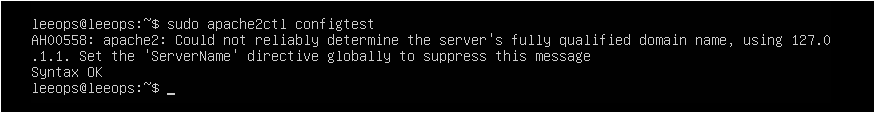

# Apache Server Setup Vulnerable

Este documento explica **cómo desplegar el servidor Apache vulnerable** utilizado en el laboratorio SIEM.  

Las vulnerabilidades configuradas en este laboratorio no son “de fantasía”. 
Son fallos reales que aparecen constantemente en webs de producción: 
uploads sin filtrar, permisos 777, directory listing activado, logs expuestos y falta total de hardening.
Este Apache vulnerable reproduce exactamente ese tipo de escenarios.

---
## 1. Instalación de Apache
---

El clásico:
```
sudo apt update 
sudo apt install apache2 -y
```

Cuando ejecutas eso, pasa una cosa curiosa:

 **Instalas Apache → APT aprovecha para actualizar dependencias del sistema → Ubuntu detecta cosas pendientes → te enseña pantallas raras.**

**Importante:**  
 - NO son pantallas de Apache.
 - Son pantallas de Ubuntu.

PANTALLA 1: 

Te está diciendo exactamente:

> “Oye, ya que estás, reinicia para usar el kernel nuevo, que yo no lo activo solo.”

Significa exactamente eso:  
Ubuntu detectó que hay un **kernel nuevo instalado**, pero **tú sigues usando el anterior**.

- **Pulsa ENTER.**  
Puedes reiniciar luego cuando te venga bien.


PANTALLA 2:

> “Hay servicios usando librerías antiguas.  
> ¿Quieres reiniciarlos?”

Eso aparece cuando Ubuntu termina de actualizar paquetes y detecta que algunos servicios están usando librerías viejas. (_No tiene nada que ver con Apache_)

Aquí simplemente:
- Selecciona todos  
- Pulsa ENTER


Luego reinicias el servicio:

```
sudo systemctl restart apache2
```

---
## 2. Comprobar que Apache está funcionando
---

Ahora sí, toca revisar Apache realmente:

```
systemctl status apache2
```


Si te sale activo: ¡Listo!

----
## 3. Configurar Apache Débil 
---
 
 #### 1. Activar Directory Listing 
 Permite navegar por carpetas como si fuera un FTP.   Ideal para que un atacante vea archivos internos y para generar logs interesantes.  
 
Editar:
```
sudo nano /etc/apache2/sites-available/000-default.conf
```

Por defecto viene así:


Y hay que dejarlo así:

 
 y además incluir lo siguiente:


Cosas claves que hemos hecho:

- `Options Indexes` → **directory listing** activado.
- `AllowOverride All` → `.htaccess` pueden hacer lo que quieran.
- `uploads` ejecuta `.php` y `.sh`.
- Logs se guardan dentro de `/var/www/html/logs` (luego los exponemos).

Guarda el archivo y sal de nano.

#### 2. Crear carpetas y poner permisos curiosos

Creamos las carpetas vulnerables y les damos permisos muy amplios:

```
sudo mkdir -p /var/www/html/uploads 
sudo mkdir -p /var/www/html/logs 
sudo chmod -R 777 /var/www/html
```


**Explicación rápida:**

- `/uploads` → típica carpeta de subida de ficheros de cualquier web.
- `/logs` → logs accesibles vía navegador (`http://servidor/logs/`).
- `chmod -R 777` → cualquiera puede leer/escribir/ejecutar → **desastre realista** para Wazuh.

#### 3. Activar módulos necesarios

##### Módulos habilitados y por qué son peligrosos

- **autoindex** → 
           Activa el directory listing. Permite ver todo el contenido de una carpeta desde el navegador si no hay un index.  
           Vulnerabilidad típica y muy común en webs reales.

- **cgi** → 
           Permite ejecutar scripts (.sh, .cgi, .py, incluso .php si se configura).  
           Si un atacante sube un archivo ejecutable, Apache lo corre.  
           Clásico vector de RCE.

- **rewrite** → 
           Permite reglas `.htaccess`.  
           Junto a `AllowOverride All`, cualquier archivo .htaccess puede modificar el comportamiento del servidor y abrir puertas inesperadas.

Activamos módulos que hacen posible el desastre:

```
sudo a2enmod autoindex 
sudo a2enmod cgi 
sudo a2enmod rewrite
```


- `autoindex` → permite el directory listing.
- `cgi` → ejecución de scripts tipo `.cgi`/`.sh`/`.php` donde lo hayamos permitido.
- `rewrite` → útil para futuras pruebas (URLs, reglas, etc.).

Comprobamos  la sintaxis antes de reiniciar:

```
sudo apache2ctl configtest
```

Debe mostrar: `Syntax OK`.

 Si te sale el siguiente mensaje, puedes hacer 2 cosas
 1-Dejarlo así, no afecta al laboratorio, te está diciendo:
 “_No sé qué nombre de servidor usar (FQDN).  Voy a usar 127.0.1.1 por defecto._”
 

2-Si quieres dejarlo limpio, escribe esto en el archivo de configuración (`000-default.conf`)

```
ServerName 127.0.0.1
```

y te saldrá limpio:


Aplicamos cambios:

```
sudo systemctl restart apache2
```

#### 4. Comprobar que Apache está funcionando
```
systemctl status apache2
```


- Si aparece `active (running)` →  Apache arrancado con la configuración débil.
- Si no, revisar errores de sintaxis en el archivo y repetir `configtest`.

#### 5. Resumen del escenario vulnerable creado

Con estos cambios hemos conseguido que:

- Cualquier usuario pueda navegar por las carpetas (`Indexes`).
- Se puedan ejecutar scripts en `/uploads` (si subes un `.php` o `.sh`).
- Los logs de Apache estén públicamente accesibles en `/logs/`.
- Los permisos 777 permitan modificaciones “alegres” en toda la web.

Todo esto es **realista** (se ve en webs mal mantenidas) y genera eventos perfectos para que **Wazuh y el SIEM** los detecten y tú puedas analizarlos.

---
