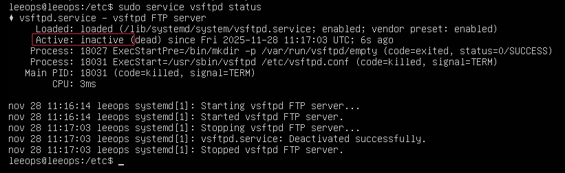
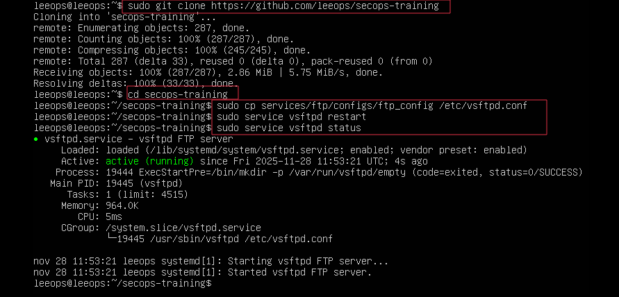
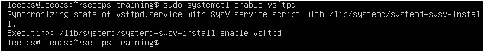
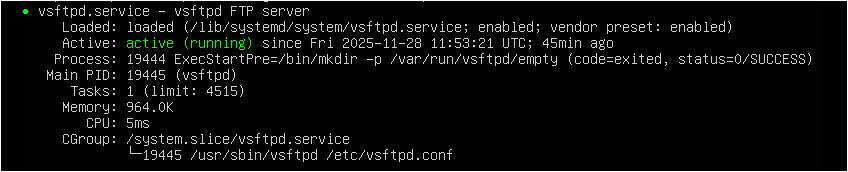
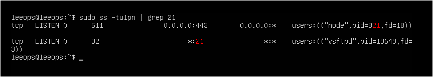

# FTP vulnerable en Ubuntu 


---
## 1. Instalar vsftpd
---

```
sudo apt update sudo apt install vsftpd -y
```

Si te pregunta algo, dile que sí. Si protesta, también.

---
## 2. Parar el servicio antes de toquetearlo
---

```
sudo systemctl stop vsftpd
```


No queremos que cargue la versión “sana” mientras tú preparas la versión “lunes por la mañana”.

---
## 3. Copiar tu configuración vulnerable
---

Tu archivo está en:
```
services/ftp/configs/ftp_config
```

Copiarlo encima del original:
*(Acuérdate si no lo tienes aún, de añadir el repositorio primero)*
```
sudo cp services/ftp/configs/ftp_config /etc/vsftpd.conf
```



Y ya puedes oír al daemon llorar en silencio.

---
## 4. Crear usuario vulnerable (opcional)
----

```
sudo useradd -m ftpuser 
echo "ftpuser:123456" | sudo chpasswd
```

Puedes cambiarle el nombre…  
Pero si lo dejas así, Hydra te lo agradece.


---
## 5. Reiniciar vsftpd
----

```
sudo systemctl restart vsftpd     # Reinicia
sudo systemctl enable vsftpd      # Habilita arranque al inicio del sistema
```






---
## 6. Comprobar que está vivo
---

### a) Ver que escucha en su puerto:

```
sudo ss -tulpn | grep 21
```



---
