# MYSQL Vulnerable

---
## 1. Instalación Mysql
---
Antes de empezar a romper cosas, primero instalamos MySQL como si fuéramos una empresa que “ya lo configurará mañana”.

```
sudo apt update 
sudo apt install mysql-server -y
```

Para comprobar que el servicio respira y no ha explotado nada (todavía):

```
sudo systemctl status mysql
```

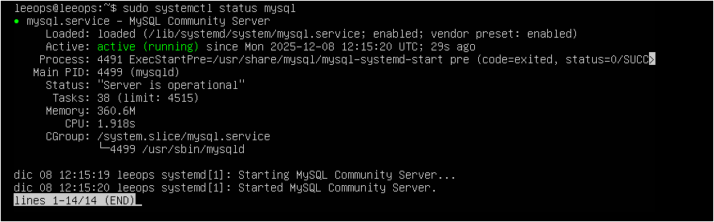

---
## 2. Hacerlo Vulnerable
----

### **(1) Crear un usuario administrativo con contraseña débil**
---


El error realista no es “root sin contraseña”,  
sino el clásico:

> **admin / Admin1234**  
> (el combo favorito de medio sector PYME)

Entramos en MySQL:
```
sudo mysql
```

Ahora vamos por pasos, sin líos.

1. Creamos usuario vulnerable:

```
CREATE USER 'admin'@'%' IDENTIFIED BY 'Admin1234'; 
```

**Qué hace este crimen:**

- **`admin`**  
    Nombre del usuario MySQL. Muy original, lo sé.
    
- **`@'%'`**  
    Permite conectarse **desde cualquier IP del planeta**.  
    Barra libre estilo “entra quien quiera”.
    
- **`IDENTIFIED BY 'Admin1234'`**  
    Contraseña débil, típica, y perfecta para romper en 0.3 segundos.

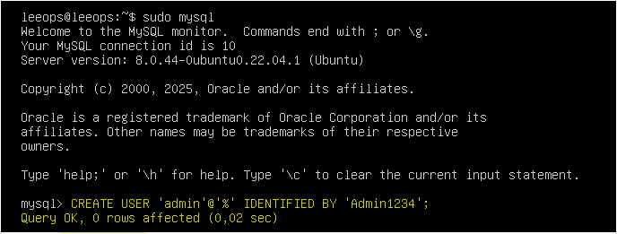

Ya tenemos el usuario creado:

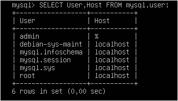

2. Darle permisos y aplicar cambios:

```
GRANT ALL PRIVILEGES ON *.* TO 'admin'@'%' WITH GRANT OPTION; FLUSH PRIVILEGES;
```

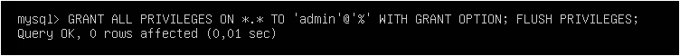


**Qué significa esto en idioma empresa realista:**

- Le das **todos** los privilegios sobre **todo**.
- Puede administrarlo **todo**, incluso crear más usuarios.
- Se puede conectar **desde cualquier sitio**.
- Y encima con una contraseña flojísima.

Una receta perfecta para el desastre… 

### **(2) Exponer MySQL al exterior (error nº1 de empresas)**
---
Porque si un servicio no está expuesto… ¿realmente es vulnerable?

Editamos la configuración de MySQL:

```
sudo nano /etc/mysql/mysql.conf.d/mysqld.cnf
```

Buscamos la línea que mantiene a MySQL a salvo del mundo:

```
bind-address = 127.0.0.1
mysqlx-bind-address = 127.0.0.1
```

Y la reemplazamos por:

```
bind-address = 0.0.0.0
mysqlx-bind-address = 0.0.0.0
```

Esto expone MySQL “por partida doble”, perfecto para escaneos, pruebas de enumeración y para que los atacantes pongan tu servidor en su lista de favoritos sin hacer esfuerzo.

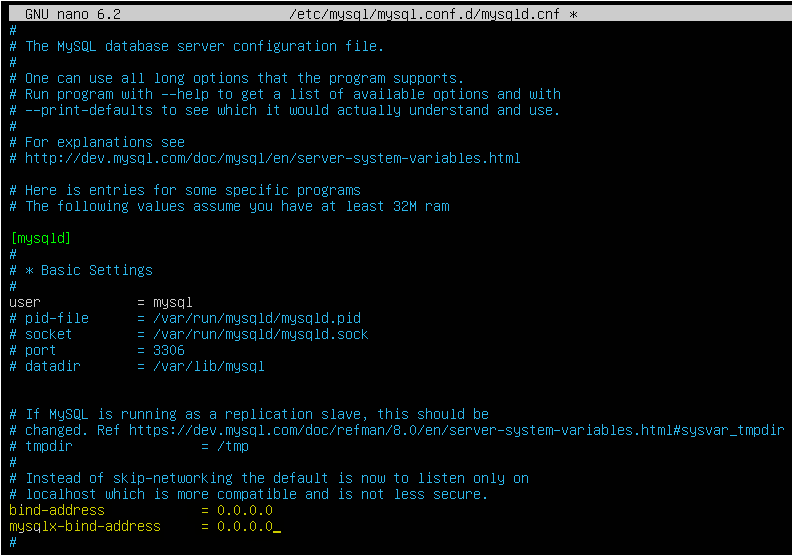

**Traducción:**  
“Querido internet, aquí tienes mi MySQL. Pásate cuando quieras.”

Sí, esto es totalmente realista: hay empresas que exponen el puerto 3306 como quien deja una ventana abierta “porque total, no va a pasar nada”.

Reiniciar:

```
sudo systemctl restart mysql
```

#### ¿Por qué las empresas exponen MySQL si viene cerrado por defecto?

>Porque MySQL nace seguro… y luego la realidad entra por la puerta.

- Se abre para que una app externa “pueda conectar”.
- Alguien sigue un tutorial y cambia `0.0.0.0` sin revisar riesgos.
- Se desactiva el firewall para hacer una prueba y nunca se vuelve a activar.
- MySQL 8 trae dos servicios y se ajustan ambos sin saber que exponen dos puertos.
- Docker publica 3306 al exterior sin que nadie se dé cuenta.

Resultado:  
**Una configuración pensada para pruebas internas termina visible desde Internet.**

Nadie lo hace a propósito; simplemente pasa… demasiado a menudo.


### **(3) Guardar un backup.sql sensible en un sitio expuesto**
---

Este laboratorio incluye un **backup SQL realista**, listo para importar sin crear nada a mano.  
Contiene:

- Base de datos `backup`
- Tabla `usuarios`
- 10 registros ficticios
- Estructura completa de ejemplo para pruebas

#### 1. Subir Backup vulnerable incluido (`configs/backup.sql`)

Importar:

```
# Si no lo has hecho ya...
sudo git clone https://github.com/leeops/secops-training
cd secops-training

# Importar la base de datos (Entra como root para que no te de error por permisos)
mysql -u root -p < services/mysql/configs/empresa.sql
```

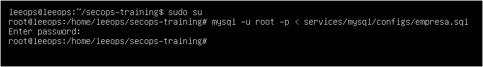

El clásico de los clásicos:  
Una copia de seguridad dejada “solo un momento” en la carpeta web… y ahí se queda.

Comprobamos que la importación se ha realizado correctamente:
- Entramos como root en MySQL y le pedimos que nos enseñe sus tesoros:

```
mysql -u root -p
SHOW DATABASES;
```

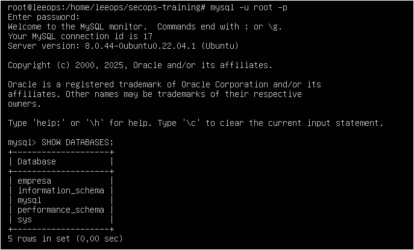

- Primero entramos en la base de datos y le pedimos a MySQL que nos muestre las mesas del restaurante:

```
USE empresa;
SHOW TABLES;
```


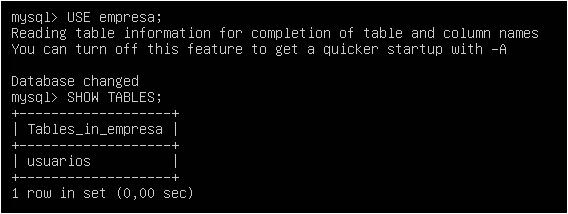

- Por último, comprobamos que dentro hay vida:

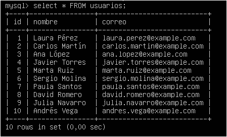

Si te devuelve los 10 registros ficticios, perfecto.  

#### 2. Creamos un backup accesible desde Internet:

```
sudo sh -c "mysqldump -u admin -pAdmin1234 empresa > /var/www/html/backup.sql"
```


Cualquier atacante (o auditor) puede llevárselo así: `http://IP/backup.sql`

Un archivo con todas las tablas, usuarios y datos.  
**Más cómodo imposible.**

#### 3. Comprobamos que esté ahí.
Tu base de datos está lista para ser **respaldada, expuesta y descubierta por cualquiera que pase por `http://IP/backup.sql`.**

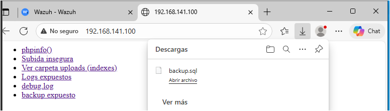

En Windows ocurre algo “precioso”: no ves el contenido del backup en el navegador… **porque te lo descarga directamente sin preguntar**.  
El servidor lo entrega tan alegremente que el navegador entiende:

> “Esto debe ser importante, te lo guardo yo.”

El resultado es el mismo, pero más cómodo aún:  
**un clic y el atacante ya tiene toda tu base de datos en la carpeta de Descargas.**

Y sí… he visto esto en auditorías reales **más veces de las que me gustaría admitir**. Cada backup expuesto cuenta una historia distinta, pero todas acaban igual: _con alguien descargando lo que nunca debería haber estado ahí._

#### 3. ¿Por qué alguien dejaría un backup ahí?

Porque la vida real no es un manual de ciberseguridad.
Muchísimas veces el backup termina en `/var/www/html` por razones tan humanas como:

- _“Lo dejo aquí un momento para descargármelo desde casa.”_
- _“Luego lo muevo a su carpeta…”_
- _“Así el programador puede cogerlo rápido.”_
- _“No sabía dónde meterlo y aquí funcionaba.”_

El problema es que ese “momento” suele durar **semanas**, y mientras tanto el archivo está servido en bandeja a cualquiera que visite la URL.

Y sí:  
**esto es mucho más común de lo que podríamos pensar.**


### **(4) Logs con queries sensibles expuestos**

Ahora activamos el “general log”, también conocido como:

> **el diario personal de MySQL donde apunta absolutamente TODO lo que haces.**

Editamos la configuración:
```
/etc/mysql/mysql.conf.d/mysqld.cnf
```

Añadimos estas dos líneas:

```
general_log = 1
general_log_file = /var/log/mysql/general.log
```

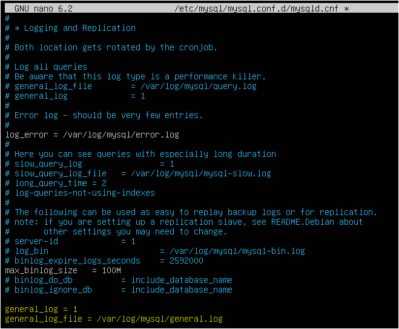

MySQL empezará a guardar:

- contraseñas en texto plano (sí, en 2025 todavía pasa)
- consultas de usuarios
- datos internos
- y cualquier comando que se le susurre

Vamos, lo más parecido a dejar un micrófono abierto dentro de la base de datos.

Reiniciamos para activar el espectáculo:

```
sudo systemctl restart mysql
```

A partir de aquí, cualquier persona que pueda leer este log tendrá un resumen detallado de la vida secreta de tu servidor.

#### **¿Por qué se activa esto en la vida real?**

Porque el “general log” debería usarse solo para diagnósticos…  
pero en muchas empresas se queda activado por razones tan humanas como:

- _“Lo enciendo un momento para ver qué consulta está fallando.”_
- _“Lo activo mientras depuro y luego lo quito.”_ (spoiler: no lo quitan)
- _“Lo pidió el desarrollador para comprobar un bug.”_
- _“Lo dejamos por si vuelve a fallar algo.”_

¿El resultado?  
MySQL apuntando contraseñas, consultas y datos sensibles en un archivo de texto **durante semanas o meses**, accesible para cualquiera con permisos de lectura.

Y sí: esto también lo he visto en auditorías reales más veces de lo que me gustaría.


### (5) Instalar phpMyAdmin expuesto (la guinda del pastel)

El postre favorito de cualquier pentester.  
Y, por desgracia, también una de las configuraciones más comunes en empresas pequeñas.

- 1. Instalamos phpMyAdmin en modo “barra libre”:

```
sudo apt install phpmyadmin -y
```

Todo next-next hasta que te pida contraseña : Admin1234, si la misma.

- 2. Creamos el enlace simbólico:
Ubuntu instala phpMyAdmin en /usr/share/phpmyadmin, pero Apache solo sirve /var/www/html.
Por eso hay que crear un enlace simbólico para que Apache "vea" phpMyAdmin.

```
sudo ln -s /usr/share/phpmyadmin /var/www/html/phpmyadmin
sudo systemctl restart apache2
```

Automáticamente queda accesible en:
```
http://IP/phpmyadmin
```

Con usuario “admin” y contraseña “Admin1234”.

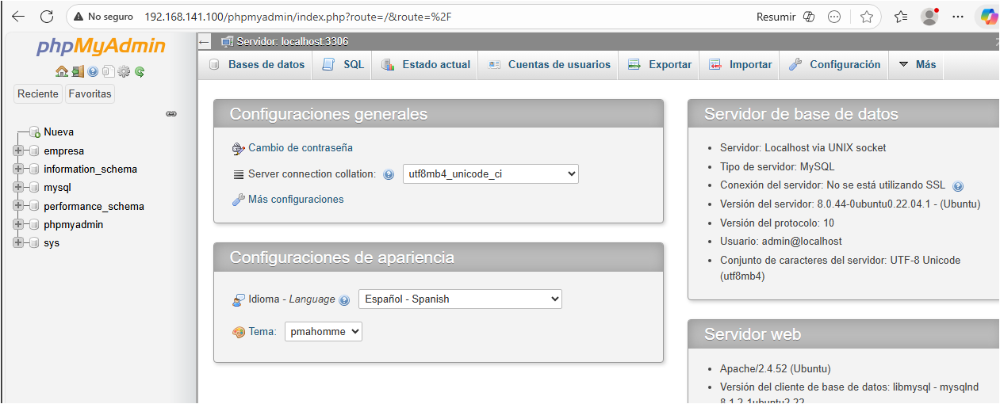

🎁 **Esto sí es un regalo para cualquier atacante.**
