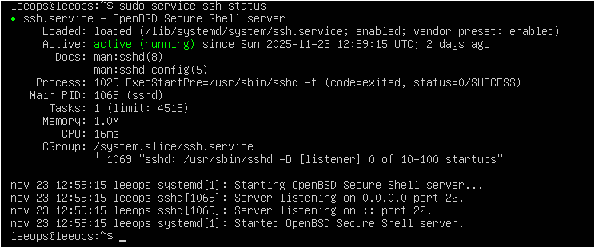
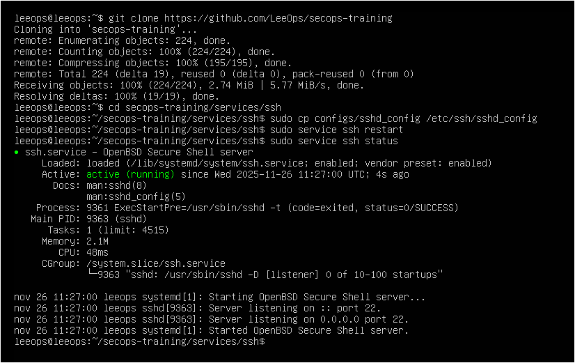
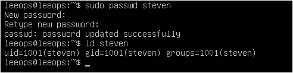
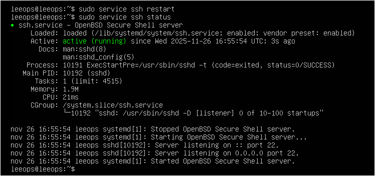
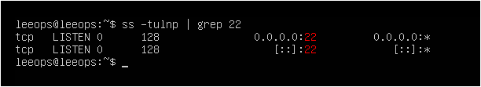

# Despliegue del Servicio SSH Vulnerable 

Este documento explica cómo **instalar, configurar y activar** un servicio SSH vulnerable para las pruebas de fuerza bruta y detección con Wazuh dentro del laboratorio LeeOps.

---
## 1. Instalación de OpenSSH Server
----

```bash
sudo apt update
sudo apt install openssh-server -y
```


Comprobar que el servicio está activo:
`sudo service ssh status`



---
## 2. Aplicar la configuración vulnerable
----

Copiar el archivo incluido en este servicio:

```
git clone https://github.com/LeeOps/secops-training
cd secops-training/services/ssh
sudo cp configs/sshd_config /etc/ssh/sshd_config
sudo service ssh restart
sudo service ssh status

```



Esta configuración incluye:
- **PermitRootLogin yes** (permite login directo como root)
- **PasswordAuthentication yes** (necesario para fuerza bruta)
- **LogLevel VERBOSE** (más detalle para Wazuh)
- Escucha en todas las interfaces

---
## 3. Crear usuario vulnerable (opcional)
---

Puedes usar `root`, pero se recomienda crear un usuario débil para la PoC:

```
sudo useradd -m -s /bin/bash steven
```


Usar una contraseña **débil**, por ejemplo:
`123456`



---
## 4. Reiniciar el servicio SSH
---
```
sudo service ssh restart
```



---
## 5. Validación rápida del despliegue
----

### ✔️ Comprobar que SSH está escuchando:

```
ss -tulnp | grep 22
```

Debe aparecer algo como:
`LISTEN 0 128 0.0.0.0:22 LISTEN 0 128 [::]:22`


### ✔️ Comprobar que el usuario existe:

`id steven`

Ya lo hemos hecho antes en el paso 3.

### ✔️ Comprobar su HOME:

` sudo ls -la /home/steven`

---
