# Descarga e instalación de SYSMON

---
## 1. Descripción
---

### ¿Qué es Sysmon?
**Sysmon** (System Monitor) es una herramienta de Microsoft que se instala en Windows para **registrar TODO lo importante que ocurre en el sistema**:

- qué procesos se ejecutan
- qué archivos se crean
- qué conexiones de red abre cada programa
- qué cambios hay en el registro
- qué DLL se cargan
- qué procesos se inyectan unos a otros
- qué comandos raros se lanzan

Es como ponerle **una cámara de vigilancia 24/7 al Windows**.

### ¿Para qué sirve Sysmon?
Sirve para **detección de amenazas**, porque registra **acciones que los virus, hackers o malware NO pueden evitar**.

En pocas palabras:

👉 **Sysmon sirve para ver lo que el malware intenta esconder.**


### ¿Qué relación tiene Sysmon con Wazuh?
Wazuh **no recoge eventos por sí mismo**.  
Recoge **lo que le envía cada agente**.

Y el agente de Windows, por defecto, **solo ve los eventos básicos de Windows**, que son:

- inicio/apagado
- login/logoff
- algún error
- cambios simples de servicios
- poco más

Es decir:

👉 **Wazuh sin Sysmon ve MUY POCO.**  
👉 **Wazuh con Sysmon se convierte en un SIEM de verdad.**

### Entonces… ¿cuál es el papel de cada uno?

#### ✔ **Sysmon**
Recolecta eventos MUY detallados del sistema.  
(Es como el sensor.)

#### ✔ **Wazuh Agent**

Los recoge y los envía al Manager.  
(Es como el mensajero.)

#### ✔ **Wazuh Manager + Dashboard**

Los analiza, aplica reglas, alerta, investiga.  
(Es como el jefe de policía.)


### ¿Qué pasa si solo usas Wazuh sin Sysmon?


👉 **Wazuh ve un Windows casi “ciego”.  
No puedes detectar malware.  
No puedes detectar ataques.  
No puedes ver nada interesante.**

Windows sin Sysmon es como conducir con los ojos cerrados, técnicamente puedes… pero no deberías


### ¿Qué pasa cuando añades Sysmon?

Todo cambia.

Wazuh empieza a recibir:

- Process Create (evento 1)
- Network Connect (evento 3)
- File Create (evento 11)
- Registry Set (evento 13)
- Pipe Created (evento 17)
- DNS Queries (evento 22)
- WMI Events (evento 19)
- Rare DLL loads
- Inyecciones de procesos
- Conexiones remotas extrañas
- Comandos Powershell completos
- Hashes de ejecutables

👉 **Eso es detección REAL.  
Eso es un SIEM de verdad.**

---
## 2. Descarga Sysmon 
---

En tu **Windows Pro**:

1. Entra a la web oficial de Sysinternals:  
 https://learn.microsoft.com/en-us/sysinternals/downloads/sysmon
 
 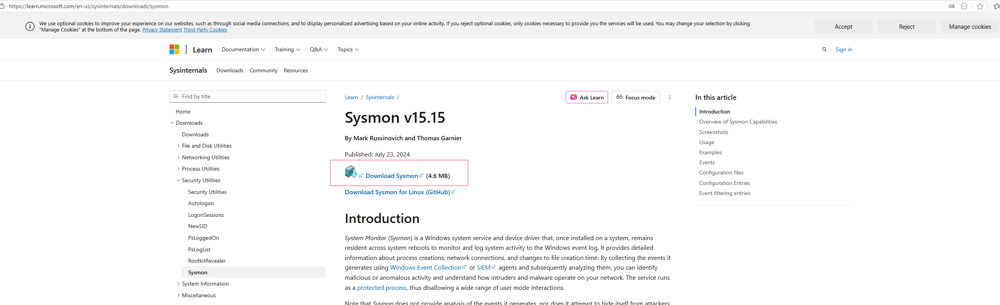
 
1. Descarga **Sysmon.zip**.
2. Descomprime el ZIP en una carpeta, por ejemplo:
    `C:\Tools\Sysmon`

Te quedarás con:
- ✔ `Sysmon64.exe` (para sistemas x64)
- ❌ `Sysmon.exe` (para x86, no nos sirve)


 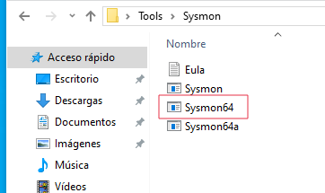

###  Descargar la mejor configuración (SwiftOnSecurity)

Sin esta config, Sysmon genera más ruido que una discoteca a las 5 AM.  
Con ella, Sysmon se vuelve **útil**.

Descárgala aquí directamente:
https://github.com/SwiftOnSecurity/sysmon-config/blob/master/sysmonconfig-export.xml

#### Cómo descargarla bien (sin que Windows te lo guarde como `.xml.txt`):

1. En el repo, clic en **sysmonconfig-export.xml**

 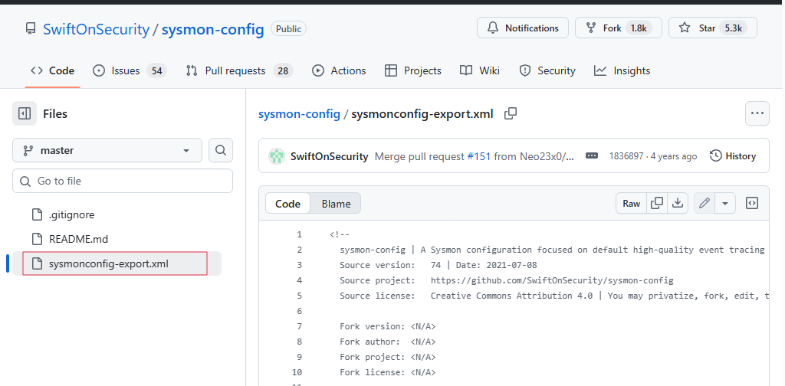

2. Arriba a la derecha, clic en **Raw**

 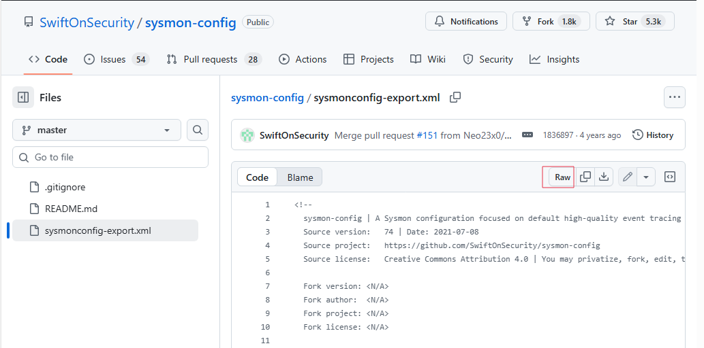

Se abrirá el código entero.
Clic derecho → **Guardar como…**

 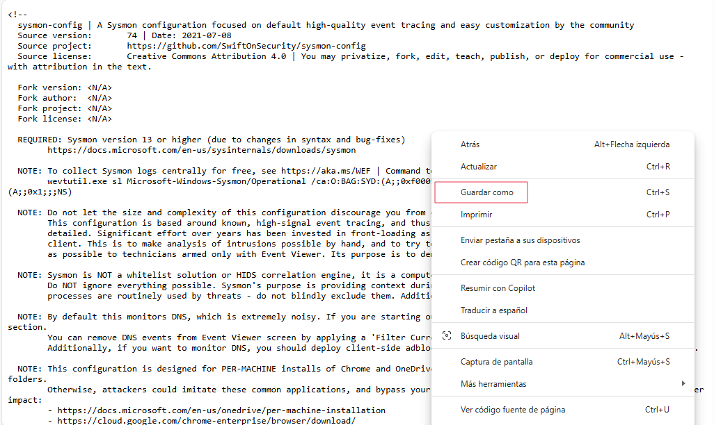

Guárdalo **junto a los otros archivos**, como un miembro más de la banda:
(La ruta de abajo es orientativa, si tu lo tienes en otro lado guárdalo en tu ruta)
`C:\Users\leeops\Desktop\Tools\Sysmon`

 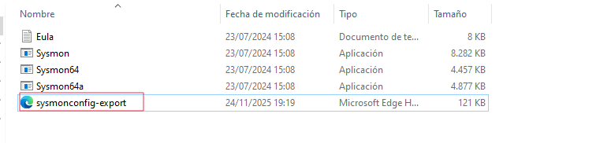

Asegúrate de que el archivo se llama EXACTAMENTE: `sysmonconfig-export.xml`
(si Windows intenta sabotearte y ponerle `.txt`, se lo quitas)

---
## 3. Instalar Sysmon con SwiftOnSecurity
----

**Abrir PowerShell como Administrador**
Importantísimo.

1. Inicio → escribe **PowerShell**
2. Click derecho → **Ejecutar como administrador**
3. Acepta el aviso .

Cuando tengas la ventanita azul lista, escribe tu ruta: (Te dejo el ejemplo de la mía)
``C:\Users\leeops\Desktop\Tools\Sysmon``

En tu PowerShell (como admin), ejecuta:

`Sysmon64.exe -i sysmonconfig-export.xml`

Si falla, prueba así:
``.\Sysmon64.exe -i sysmonconfig-export.xml``

 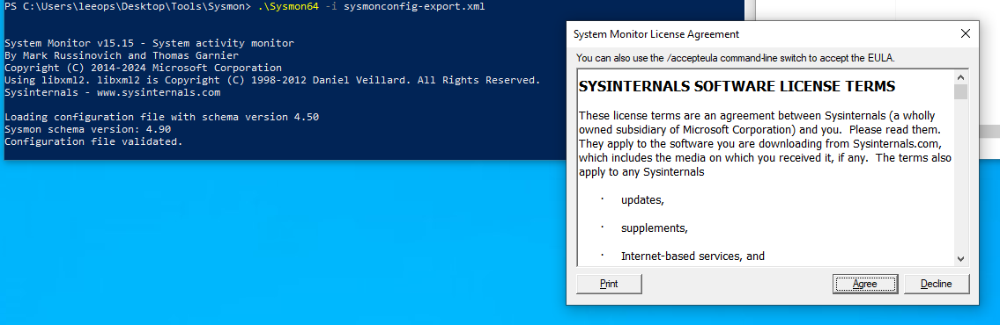
**IMPORTANTE:**

- que el nombre del archivo sea EXACTO
- que esté en la misma carpeta
- que no tenga extensión escondida (.txt)

Si todo va bien, verás algo como:
`System Monitor v14.x installed Sysmon64 installed.`


 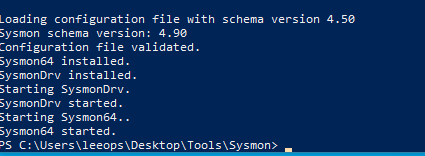
 
¡Todo listo!

---
## 4. Comprobar que Sysmon funciona*
---
Haz esto:

1. Abre **Visor de eventos** (`eventvwr.msc`)
2. Navega a:

 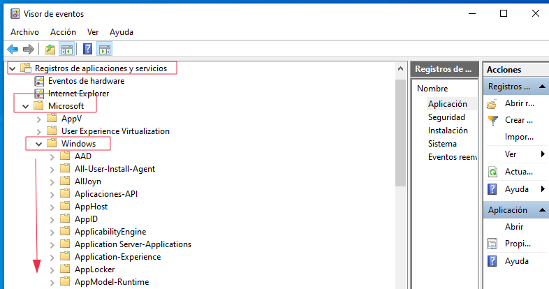

Applications and Services Logs  → Microsoft   → Windows   → Sysmon  → Operational

3. A la derecha deben aparecerte eventos como:
- **EventID 1** – Process Create
- **EventID 3** – Network Connection
- **EventID 11** – File Create
- **EventID 13** – Registry Change
- **EventID 22** – DNS Query

 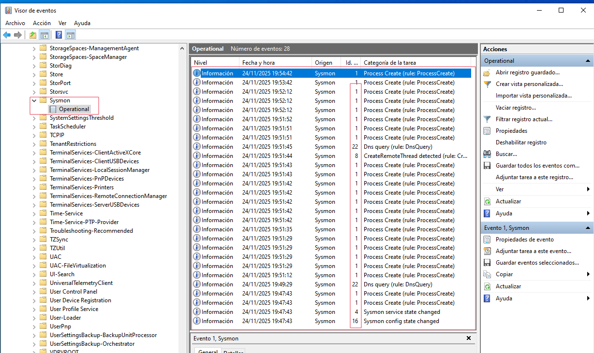

Si los ves, Windows ahora mismo está **cantándolo todo**.


---
## 5. Hacer que Wazuh LEA los eventos Sysmon
----

### EL PASO CLAVE: decirle al agente de Wazuh que lea el canal de Sysmon

Sin esto, Sysmon habla… pero Wazuh no lo oye.  
Con esto, Wazuh empieza a recibir TODA la fiesta de eventos.

Vamos paso a paso:

#### 1️. Abrir el archivo de configuración del agente Wazuh en Windows

En tu Windows Pro:
Ve a:
```
C:\Program Files (x86)\ossec-agent\ossec.conf
```

Ábrelo con Notepad++ o con el bloc (pero mejor Notepad++, que no destroza el XML).

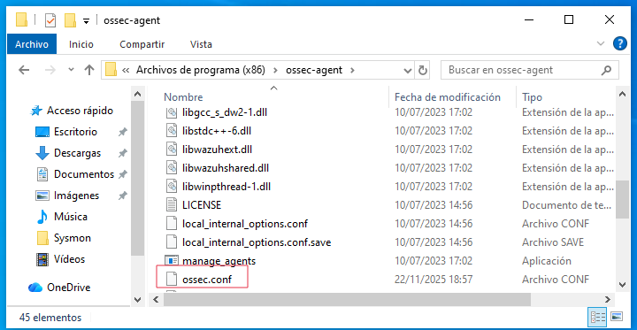

#### 2. Añadir el bloque para Sysmon

Dentro del archivo, busca la sección donde están los `<localfile>`.

Y añade ESTO (tal cual):

```
<localfile>     
   <location>Microsoft-Windows-Sysmon/Operational</location>     
   <log_format>eventchannel</log_format> 
</localfile>
```

 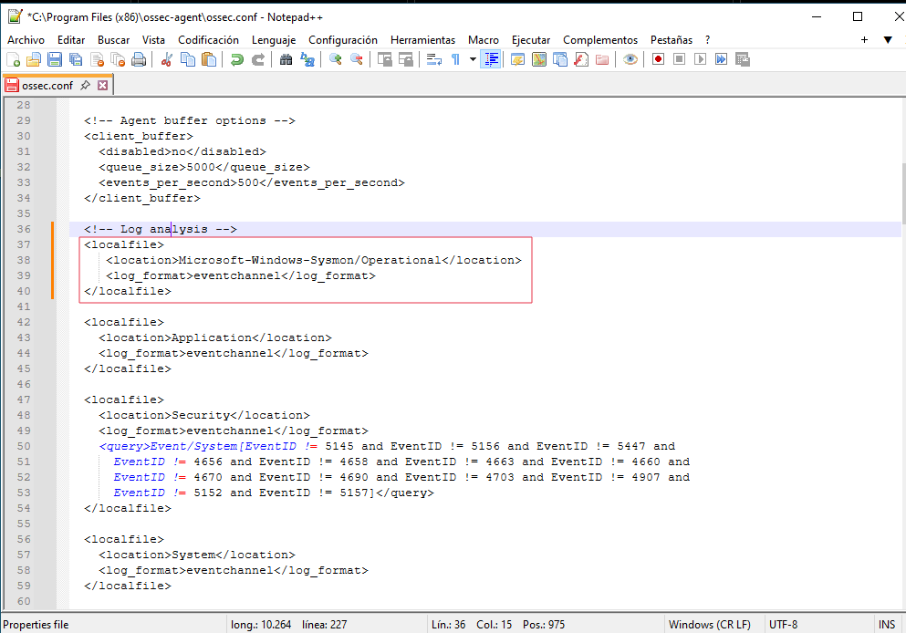

👉 Este bloque es **EL que une Sysmon con Wazuh**  
👉 Le dice al agente: “lee el canal de Sysmon y mándalo al Manager”

Sin esto: Sysmon y Wazuh no se hablan.  
Con esto: son mejores amigos.

#### 3. Guardar y reiniciar el agente

En PowerShell (como admin): `Restart-Service Wazuh`

 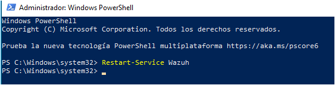

(El servicio se llama **Wazuh**, no ossec, ya lo sé. Cosas de ellos 😅)
En menos de 10–15 segundos, Wazuh empezará a recibir los eventos.


#### 4. Comprobar en el Dashboard si ya llegan los eventos de Sysmon

En tu Dashboard:
**Security Events → Rules**

 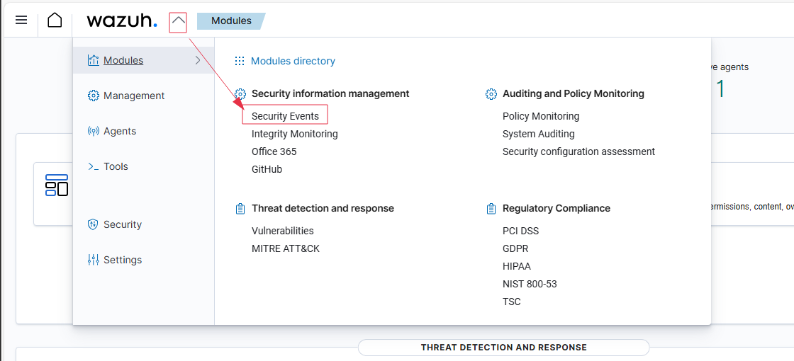

Cambia la fecha a los últimos 15 minutos y busca eventos:

- “sysmon”
- “process create”
- “40000”
- “40001”
- “network connect”
- “file create”

 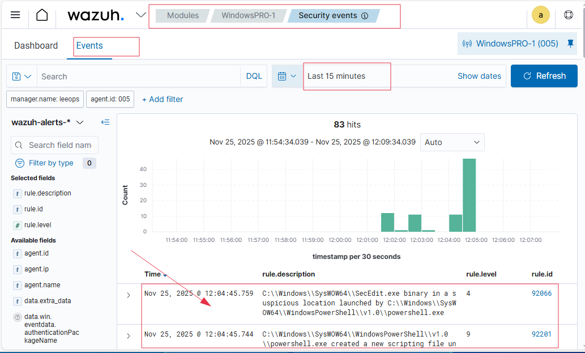

Te debería salir los eventos nuevos. Si abres las reglas verás que provienen de sysmon.

---
## 6. Sysmon instalado y funcionando
---

Ya tenemos **Sysmon** correctamente instalado en el equipo Windows y enviando eventos al **manager de Wazuh**.  
El agente está conectado, el canal `Microsoft-Windows-Sysmon/Operational` se analiza sin errores y las primeras detecciones **MITRE/Sysmon** ya aparecen en el Dashboard (process creation, PowerShell activity, discovery commands, DNS queries, etc.).

Esto confirma que:

- Sysmon genera eventos → ✔
- El agente Wazuh los lee → ✔
- El manager los procesa → ✔
- Las reglas Sysmon/MITRE se disparan → ✔
- El dashboard muestra alertas en tiempo real → ✔

---
 ## ➡️ Siguiente paso: Configuración de reglas

---

 ##### 👉 [Ir a Configuración de Reglas](../configuracion/reglas/README.md)

